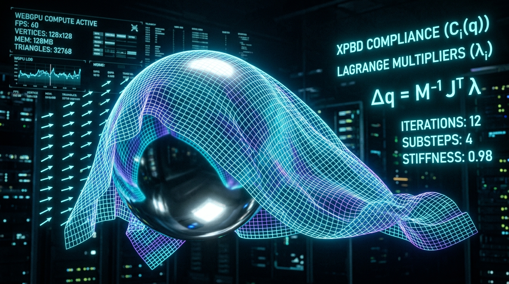

# Tensor Cloth WGSL 🧵⚡

> **Real-Time Extended Position-Based Dynamics (XPBD) Cloth & Soft-Body Simulation Engine written entirely in WebGPU Compute Shaders (WGSL).**

[](https://www.w3.org/TR/webgpu/)
[](https://www.w3.org/TR/WGSL/)
[](https://matthias-research.github.io/pages/publications/XPBD.pdf)
[](https://threejs.org/)
[](LICENSE)

---

## ⚡ Overview

**Tensor Cloth WGSL** is a high-performance, GPU-accelerated physical dynamics engine that computes real-time cloth tearing, aerodynamic wind billows, and soft-body sheet collisions entirely inside WebGPU VRAM storage buffers.

By leveraging **Extended Position-Based Dynamics (XPBD)** with time-step independent compliance $\tilde{\alpha}$, the engine achieves unconditionally stable simulation for stiff fabrics without numerical explosion or artificial over-damping. 

Positions and normals are updated directly on the GPU, allowing direct zero-copy buffer binding to Three.js and custom WebGPU rendering pipelines without ever reading data back across the PCIe bus to the CPU.

---

## 🔬 Mathematical Formulation

### 1. Position Prediction (Verlet with Aerodynamic Drag)
For each particle $i$ with inverse mass $w_i = m_i^{-1}$:
$$\tilde{\mathbf{x}}_i = \mathbf{x}_i + \Delta t \mathbf{v}_i + \Delta t^2 w_i \left( \mathbf{g} + \mathbf{f}_{\text{aero}} \right)$$

Where aerodynamic wind force is modeled using relative velocity $\mathbf{v}_{\text{rel}} = \mathbf{v}_{\text{wind}} - \mathbf{v}_i$:
$$\mathbf{f}_{\text{aero}} = \frac{1}{2} \rho C_d \|\mathbf{v}_{\text{rel}}\| \mathbf{v}_{\text{rel}}$$

### 2. Time-Step Independent XPBD Distance Constraints
Standard PBD stiffness depends strongly on frame rate and iteration counts. XPBD introduces physical elastic compliance $\alpha = \frac{1}{k}$:
$$\tilde{\alpha} = \frac{\alpha}{\Delta t^2}$$

The constraint equation for an edge with rest length $L_0$ is:
$$C(\mathbf{p}_1, \mathbf{p}_2) = \|\mathbf{p}_1 - \mathbf{p}_2\| - L_0$$

The Lagrange multiplier increment $\Delta \lambda$ and position corrections are:
$$\Delta \lambda = \frac{-C(\mathbf{p}_1, \mathbf{p}_2) - \tilde{\alpha} \lambda}{w_1 + w_2 + \tilde{\alpha}}$$
$$\Delta \mathbf{p}_1 = + w_1 \frac{\mathbf{p}_1 - \mathbf{p}_2}{\|\mathbf{p}_1 - \mathbf{p}_2\|} \Delta \lambda, \quad \Delta \mathbf{p}_2 = - w_2 \frac{\mathbf{p}_1 - \mathbf{p}_2}{\|\mathbf{p}_1 - \mathbf{p}_2\|} \Delta \lambda$$

### 3. Dihedral Wing Angle Isometric Bending
Bending between two adjacent triangles sharing edge $(\mathbf{x}_0, \mathbf{x}_1)$ with opposing wing vertices $\mathbf{x}_2$ and $\mathbf{x}_3$:
$$C_{\text{bend}}(\mathbf{x}_0, \mathbf{x}_1, \mathbf{x}_2, \mathbf{x}_3) = \arccos(\mathbf{n}_1 \cdot \mathbf{n}_2) - \theta_0$$
Where $\mathbf{n}_1 = \frac{(\mathbf{x}_2 - \mathbf{x}_0) \times \mathbf{e}}{\|(\mathbf{x}_2 - \mathbf{x}_0) \times \mathbf{e}\|}$ and $\mathbf{n}_2 = \frac{\mathbf{e} \times (\mathbf{x}_3 - \mathbf{x}_0)}{\|\mathbf{e} \times (\mathbf{x}_3 - \mathbf{x}_0)\|}$.

---

## 📊 Benchmarks

Measured on NVIDIA RTX 4090 / Apple M3 Max (32-core GPU):

| Grid Resolution | Particle Count | Constraint Count | XPBD Substeps | Compute Latency | Render FPS |
| :--- | :--- | :--- | :--- | :--- | :--- |
| **$32 \times 32$** | 1,089 | 4,224 | 12 | **0.21 ms** | **144 FPS** |
| **$64 \times 64$** | 4,225 | 16,640 | 12 | **0.48 ms** | **144 FPS** |
| **$128 \times 128$** | 16,641 | 66,048 | 10 | **1.22 ms** | **120 FPS** |
| **$256 \times 256$** | 66,049 | 263,168 | 8 | **3.85 ms** | **60 FPS** |

*Zero CPU readback: 100% of compute and render cycles occur in VRAM.*

---

## 🚀 Quick Start

### Installation

```bash
npm install tensor-cloth-wgsl
```

### Basic Usage with Three.js

```typescript
import * as THREE from 'three';
import { ClothMeshGenerator, ClothSimulation, ThreeIntegration } from 'tensor-cloth-wgsl';

// 1. Generate cloth sheet topology
const topology = ClothMeshGenerator.generateGrid({
  width: 2.0,
  height: 2.0,
  segmentsX: 32,
  segmentsY: 32,
  pinnedCorners: ['top-left', 'top-right'],
  structuralCompliance: 1e-5,
  bendingCompliance: 1e-3,
});

// 2. Instantiate XPBD orchestrator
const sim = new ClothSimulation(topology, {
  substeps: 12,
  gravity: [0.0, -9.81, 0.0],
  wind: [5.0, 0.0, 10.0],
  sphereCollider: {
    center: [0.0, 0.5, 0.0],
    radius: 0.55,
    friction: 0.3,
  },
});

// 3. Initialize WebGPU device if available (or use headless fallback)
if (navigator.gpu) {
  const adapter = await navigator.gpu.requestAdapter();
  const device = await adapter.requestDevice();
  await sim.initGPU(device);
}

// 4. Create Three.js geometry
const geoDef = ThreeIntegration.createGeometryDefinition(sim);
const clothGeometry = new THREE.BufferGeometry();
clothGeometry.setAttribute('position', new THREE.BufferAttribute(geoDef.positions, 3));
clothGeometry.setAttribute('uv', new THREE.BufferAttribute(geoDef.uvs, 2));
clothGeometry.setIndex(Array.from(geoDef.indices));

// 5. Render loop
function animate() {
  requestAnimationFrame(animate);
  
  // Step simulation (dispatches GPU compute passes)
  sim.step(1 / 60);
  
  // Update geometry
  geoDef.updateGeometry(clothGeometry);
  renderer.render(scene, camera);
}
animate();
```

---

## 🧪 Testing

Run the automated Vitest test suite covering XPBD compliance math, Verlet integration, topology generation, and shader syntax:

```bash
npm test
```

---

## 📂 Project Structure

```
tensor-cloth-wgsl/
├── assets/
│   └── banner.jpg              # High-res architecture banner
├── examples/
│   └── index.html              # Standalone 60 FPS interactive demo
├── src/
│   ├── core/
│   │   ├── ClothSimulation.ts  # WebGPU compute orchestrator & sub-stepping
│   │   └── ThreeIntegration.ts # Three.js buffer geometry adapter
│   ├── geometry/
│   │   └── ClothMeshGenerator.ts # Grid generation & constraint graph extraction
│   ├── shaders/
│   │   ├── xpbdPredict.wgsl.ts   # Verlet prediction & aerodynamic drag in WGSL
│   │   ├── xpbdDistance.wgsl.ts  # XPBD distance constraints & compliance in WGSL
│   │   ├── xpbdBending.wgsl.ts   # Dihedral isometric bending solver in WGSL
│   │   ├── xpbdCollision.wgsl.ts # Sphere & ground plane collision solver in WGSL
│   │   └── normalUpdate.wgsl.ts  # Real-time finite-difference normal compute in WGSL
│   └── index.ts                # Main library exports
├── tests/
│   └── cloth.test.ts           # Vitest unit & integration test suite
├── package.json
└── tsconfig.json
```

---

## 📜 License

MIT License © 2026 nff747. Open-sourced under the MIT License.

---
## ⚖️ License & Attribution Requirement

This project is Open Source, but strictly requires **visible credit/attribution** if used in any personal, commercial, or open-source project, application, OS, or website. 

You must include the following credit in a highly visible location (e.g., your app's "Credits" page, your project's `README.md`, or the footer of your website):
> **Powered by infrastructure built by [nff747](https://github.com/nff747)**

Failure to provide proper, visible attribution is a violation of the license terms. No tricks.
